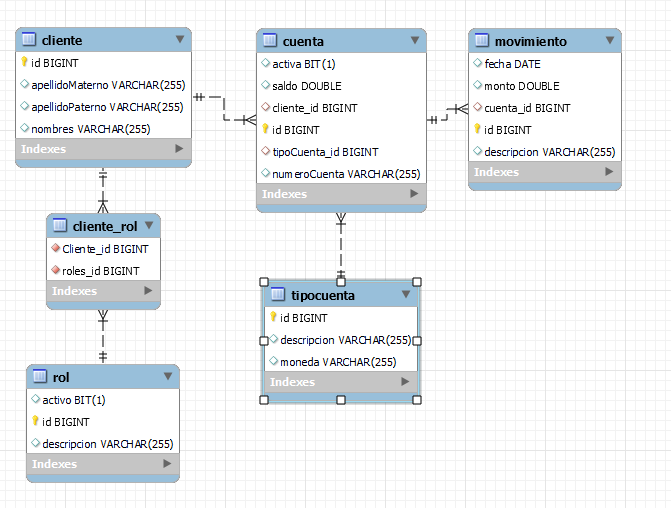

# Proyecto de Práctica de Anotaciones JPA

Este proyecto tiene como objetivo proporcionar un ejemplo práctico de cómo utilizar anotaciones JPA para establecer relaciones entre entidades y mapearlas a una base de datos relacional. En este caso, se emplearán las anotaciones `@OneToOne`, `@OneToMany`, y `@ManyToMany` para definir la estructura de la base de datos.



## Configuración del Proyecto

El proyecto está configurado para utilizar Maven y JPA para la gestión de persistencia. Asegúrese de tener configurado un servidor MySQL y una base de datos llamada `cl2_chiclla_jean`. Puede modificar la configuración de la base de datos en el archivo `persistence.xml` si es necesario.

```xml
<!-- persistence.xml -->
<!-- ... -->
<property name="jakarta.persistence.jdbc.url" value="jdbc:mysql://localhost:3306/cl2_chiclla_jean?serverTimezone=UTC"/>
<!-- ... -->
```

## Autor
- **Jean Paul Chiclla**
